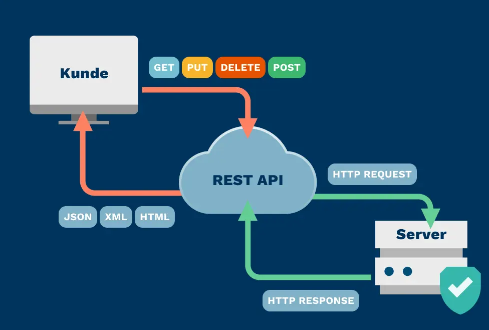
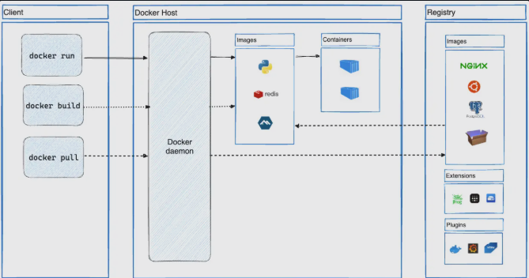

# Docker 101

## Grundlegende Konzepte

*Kernidee: Docker ist eine Plattform, mit der du Anwendungen als Container baust, testest, verteilst und betreibst.
Warum wichtig? Container enthalten alles Nötige (Code, Runtime, Systemlibs, Konfiguration) und laufen überall gleich — auf deinem Laptop, im Rechenzentrum oder in der Cloud.*

Merksatz: Image = Bauplan (read-only), Container = laufende Instanz dieses Bauplans (mit Schreibschicht).

---

## Docker Platform

Container = isolierte Laufzeitumgebung (leichtgewichtig, teilen sich den Host-Kernel).
Du kannst viele Container parallel starten (jeder hat sein eigenes Dateisystem, Netzwerk-Namespace etc.).
Da alles im Container steckt, bist du unabhängig davon, was auf dem Host installiert ist.
Du kannst Container/Images teilen (z. B. über Docker Hub) und bekommst reproduzierbare Ergebnisse.

Beispiel:

Du gibst deinem Team ein Image myapp:1.0. Alle starten denselben Container und sehen exakt das gleiche Verhalten.

---

## What can I use Docker for?

+ Schnelle, konsistente Auslieferung (CI/CD)

    Dev: Jeder entwickelt in identischer Umgebung (Container), keine „bei mir läuft’s“-Probleme.

    Test: Das gleiche Image wird automatisiert getestet.

    Prod: Dasselbe geprüfte Image wird ausgerollt.
    Vorteil: Kaum Drift zwischen Umgebungen, hohe Reproduzierbarkeit.

+ Responsives Deployment & Skalierung

    Container sind portabel (Laptop, VM, Cloud).

    Du kannst Services bei Last hoch- und runterfahren (mehr/weniger Container) — sehr schnell.

+ Mehr Workloads auf gleicher Hardware

    Container haben wenig Overhead (kein eigenes Gast-OS wie bei VMs).

    Höhere Dichte: Mehr Services auf derselben Maschine möglich → Kostenersparnis.

---

## Docker-Architektur

{width=390px} {width=500px}

Client–Server-Modell:

Docker Client (docker): dein CLI, du gibst Befehle ein.

Docker Daemon (dockerd): „Motor“, der Images baut, Container startet, Netzwerke/Volumes verwaltet.

Kommunikation: per REST-API (Unix-/Named Socket oder Netzwerk).

Docker Desktop (bei dir unter Windows 11):

Bündelt dockerd, CLI, Compose, Credential Helper, (lt. Text) auch Kubernetes-Integration.

Unter Windows läuft Linux-Docker i. d. R. über WSL 2.

Registries:

Docker Hub (öffentlich) oder private Registries.

docker pull/docker run → lädt Images; docker push → veröffentlicht Images.

---

## Docker objects

**Images**

Read-only Templates (mehrere Layer).

Entstehen aus einem Dockerfile (jede Anweisung → i. d. R. ein Layer).

Schnell zu bauen/teilen, da bei Änderungen nur geänderte Layer neu gebaut/übertragen werden.

**Container**

*Container = normale Prozesse im Host-Kernel, in Namespaces mit Limits (cgroups).*

Laufende Instanz eines Images mit zusätzlicher Writable Layer.

Du kannst Container starten/stoppen, an Netzwerke hängen, Volumes mounten, oder aus dem Containerzustand ein neues Image erstellen.

Wichtig: Änderungen im Container, die nicht in einem Volume liegen, verschwinden, wenn du den Container löschst.

```bash
docker run -i -t ubuntu /bin/bash
```

1. Fehlt das Image ubuntu lokal, wird es gepullt.
2. Es wird ein Container aus diesem Image erstellt.
3. Der Container bekommt eine Writable Layer (damit du Dateien ändern kannst).
4. Er wird ans Default-Netz angeschlossen (eigene IP, NAT nach außen).
5. Docker startet /bin/bash im Container.
    -i = interaktiv (STDIN offen halten)
    -t = Pseudo-TTY (komfortable Terminal-Interaktion)
6. exit beendet die Shell → Container stoppt, bleibt aber vorhanden (kann      wieder gestartet oder entfernt werden).

Mini-Check:
Warum siehst du nach exit den Container als „exited“? → Weil der Hauptprozess (PID 1) beendet wurde.

---

